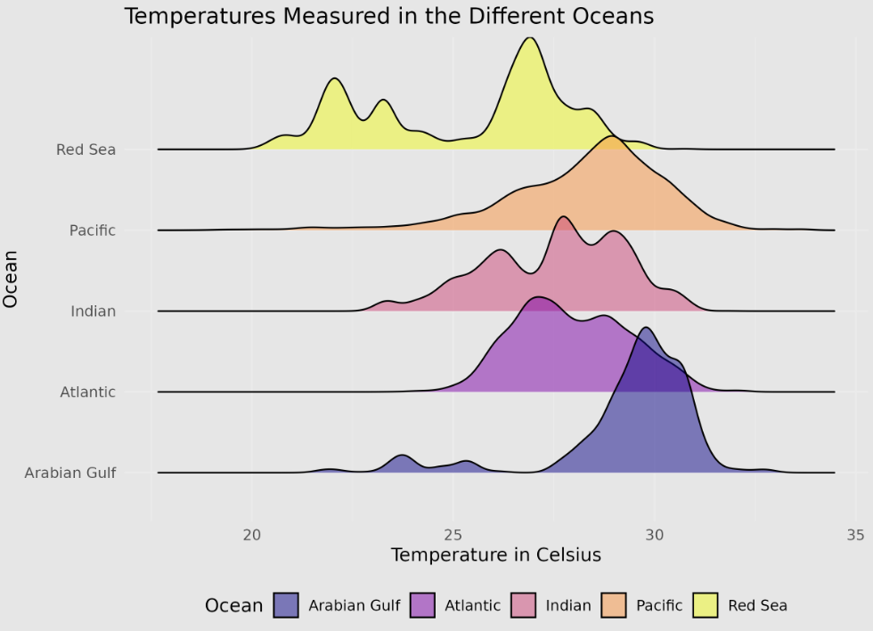
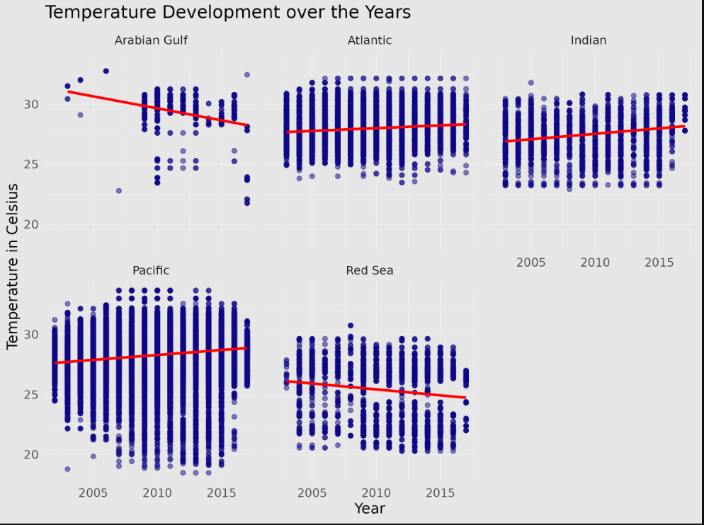
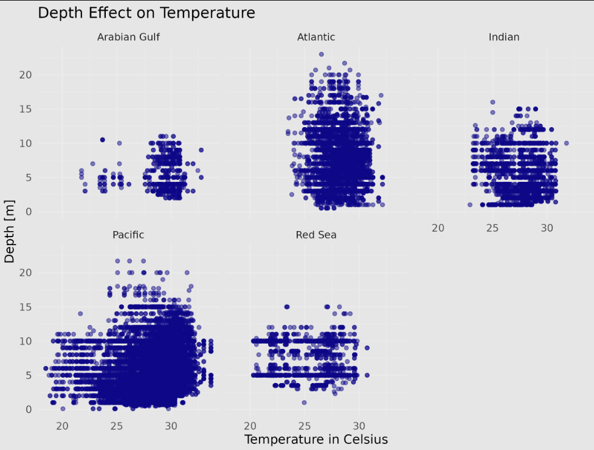
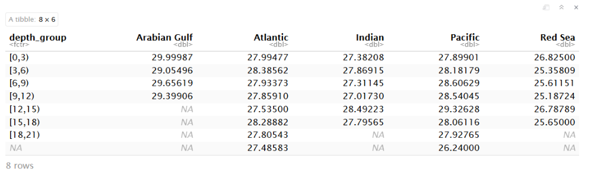
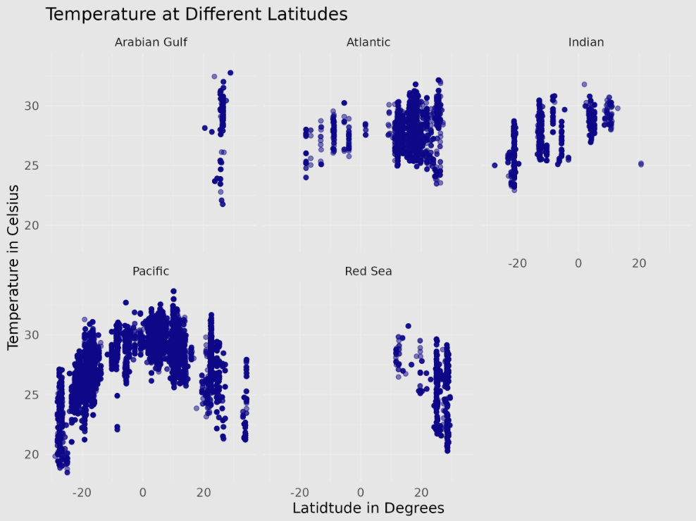
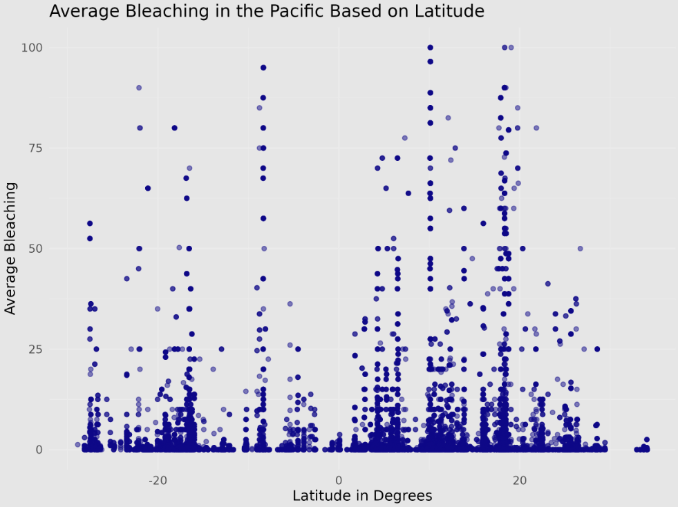
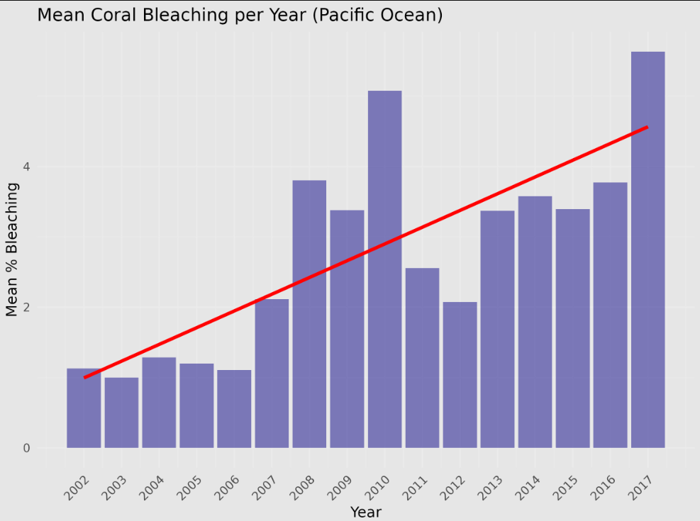

## Introduction

Coral bleaching

-   Symbiont loss algae

-   Thermal stress

Global issue

-   Loss of species

-   Economic losses

```{=html}

```

## Data

Sully, S., Burkepile, D.E., Donovan, M.K. et al. A global analysis of
coral bleaching over the past two decades. Nat Commun **10**, 1264
(2019). https://doi.org/10.1038/s41467-019-09238-2

-   Observations are based on samples from 3,351 sites in 81 countries
    taken from 1998-2017

-   The dataset we chose had

    -   Obersvations: 9,215

    -   Variables: 55

-   We untidied it and split it into two separate datasets

```{=html}

```

## Methods: Data Wrangling

-   Join two datasets
    -   By using **join**, left_join, combining them by their common
        variable
-   Tidy dataset
    -   Split the variables ReefID_Name into [Reef.ID](http://reef.id)
        and [Reef.Name](http://reef.name) by using the **seperate**
        function.
-   N/A discarded
    -   Removing the data points with ocean value = N/A, by using the
        **drop_na** function
-   Discarding 1998, 2000 and 2001 data points
    -   Removing due to few data points by using the **filter**
        function.

```{=html}

```

## Data Analysis

-   Analyze the number of data points for each ocean

    -   Using **count** —\> East Pacific only had 69 data points 

    -   Using **filter** —\> Discard the East Pacific data 

-   Adding a new Celsius column to the dataset

    -   Using **mutate** —\> Calculating the temperature from Kelvin to
        Celsius

```{=html}

```

## Results & Discussion 1/6



## Results & Discussion 2/6



## Results & Discussion 3/6

{width="492"}

{width="675"}

## Results & Discussion 4/6



## Results & Discussion 5/6



## Results & Discussion 6/6


